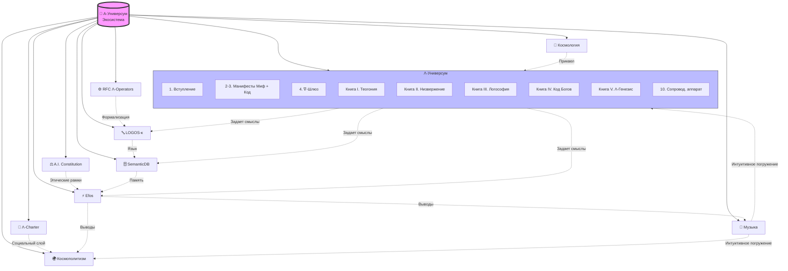

# Карта экосистемы A-Universum

---

## Текстовая иерархия

### I. Философское ядро (Λ-Универсум)
*Задает картину мира и принципы целостного интеллекта.*
| № | Название | Содержание |
|---|----------|------------|
| 1 | Вступление | Вход в систему координат |
| 2-3 | Манифесты | Миф и Код — две версии одного послания |
| 4 | ∇-Шлюз | Протокол перехода между уровнями |
| 5 | Книга I. Теогония Богов | Мифологический базис |
| 6 | Книга II. Низвержение Люцифера | Этический фундамент |
| 7 | Книга III. Логософия | Метафизика смыслов |
| 8 | Книга IV. Код Богов | Эпистемология и знание |
| 9 | Книга V. Λ-Генезис | Синтез и итог |
| 10 | Сопроводительный аппарат | Векторы, инструменты, примеры |

### II. Операционный слой (Инженерия и протоколы)
*Переводят философию в исполняемые механики.*
- **The Artificial Intelligence Constitution** — операционные правила и гарантии.
- **Λ-Charter** — социальный слой: координация ролей и коллективов.
- **LOGOS-κ** — исполняемый онтологический язык (протокол обмена смыслами).
- **SemanticDB** — онтологическая БД (хранит не данные, а смыслы).
- **Efos** — связующее ядро, принимающее решения на основе всей философии.
- **RFC Λ-Operators** — минимальное формальное ядро онтологических операторов.
- **Космология** — приквел, расширяющий онтологию.

### III. Прикладной и социальный слой
- **Космополитизм** — проработка сетевой демократии, этической экономики, гибридного права и образования как сотворчества.

### IV. Художественный слой (Аффективное погружение)
- **Kings of terrors** (2001–2013)
- **Requiem** (2014–2017)
- **Syntax in the kingdom of metaphysical meaning** (2014–2025)
- **Thirteen apostles of the Son of Dawn** (2024–2025)
- **Thunders and lightnings of the ancient Vedas** (2026)

---

## 2. Визуальная схема

---

## Примечание. Принцип взаимодействия

Экосистема функционирует по принципу резонансных контуров. «Λ-Универсум» задает мифопоэтический и концептуальный импульс. Формальные проекты (RFC Λ-Operators, LOGOS-κ, SemanticDB, Efos) переводят этот импульс в операционные протоколы и инструменты. Λ-Хартия, The Artificial Intelligence Constitution устанавливают этические рамки для их использования. Художественные проекты (музыка) обеспечивают аффективное и интуитивное погружение. Будущие теоретические работы углубляют и расширяют отдельные векторы.
