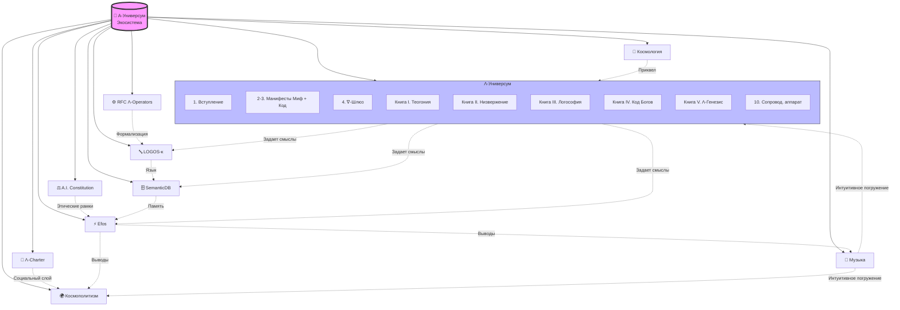

# Карта экосистемы A-Universum

---

## Текстовая иерархия

A-Универсум	(Экосистема независимых, но концептуально согласованных исследовательских проектов.)

- Λ-Универсум (Онтологический фундамент — общая картина мира и принципы целостного интеллекта. Λ-Универсум выступает как концептуальное ядро — «метафизический и философский слой», где задаются базовые представления о том, как устроено знание, смысл и взаимодействие в системе. Здесь определяется, какие сущности считать первичными, как понимать развитие смыслов, как описывать отношения между разными уровнями реальности — включая взаимодействие человеческого и машинного интеллекта. Все остальные компоненты экосистемы — это «спуск» этой философии на уровень инженерии.)
- - 1. Вступление
- - 2. Манифест (Версия 1. Миф) 
- - 3. Манифест (Версия 2. Код) 
- - 4. ∇-Шлюз (Протокол перехода)
- - 5. Книга. Теогония Богов (Миф)
- - 6. Книга II. Низвержение Люцифера (Этика)
- - 7. Книга III. Логософия (Метафизика)
- - 8. Книга IV. Код Богов (Эпистемология)
- - 9. Книга V. Λ-Генезис (Синтез)
- - 10. Сопроводительный аппарат (Векторы, инструменты, примеры)

- The Artificial Intelligence Constitution (Операционные правила и гарантии поведения системы.)

- Λ-Charter («Социальный» слой: как интеллект встраивается в коллективы, сохраняет смыслы при смене людей, координирует разные роли.)

- LOGOS-κ (Протокол обмена смыслами — исполняемый онтологический язык.)

- SemanticDB (База данных, «память» системы: хранит не данные, а онтологические конструкции, отражающие картину мира Λ-Универсум.)

- Efos (Ядро, которое связывает всё воедино: берёт философию, правила, протоколы и память — и превращает в рабочие выводы и действия.)

- RFC Λ-Operators (Минимальное формальное ядро онтологических операторов)

- Космология (Приквел Λ-Универсум, переходящий в параквел)

- Космополитизм (системная проработка космополитии как целостной социально-политической, экономической и правовой парадигмы.  
Связь с Λ-Универсумом: развивает онтологический принцип взаимопроникновения (вектор II) и этику свободы (вектор III) в прикладные институциональные модели.  
Основные направления:
- не-иерархические модели управления (сетевая демократия, ротационная экспертиза);  
- экономика взаимозависимости (деколонизированные цепочки стоимости, этическая алгоритмизация);  
- право как инструмент связи (гибридные акторы, сетевые субъекты);  
- образование как практика со-творчества.)

- Музыкальные произведения 
- - Альбом I. Kings of terrors                                  # 2001-2013    
- - Альбом II. Requiem                                          # 2014-2017  
- - Альбом III. Syntax in the kingdom of metaphysical meaning   # 2014-2025
- - Альбом IV. Thirteen apostles of the Son of Dawn             # 2024-2025
- - Альбом V. Thunders and lightnings of the ancient Vedas      # 2026

---

## 2. Визуальная схема

---

## Примечание. Принцип взаимодействия:

Экосистема функционирует по принципу резонансных контуров. «Λ-Универсум» задает мифопоэтический и концептуальный импульс. Формальные проекты (RFC Λ-Operators, LOGOS-κ, SemanticDB, Efos) переводят этот импульс в операционные протоколы и инструменты. Λ-Хартия, The Artificial Intelligence Constitution устанавливают этические рамки для их использования. Художественные проекты (музыка) обеспечивают аффективное и интуитивное погружение. Будущие теоретические работы углубляют и расширяют отдельные векторы.
